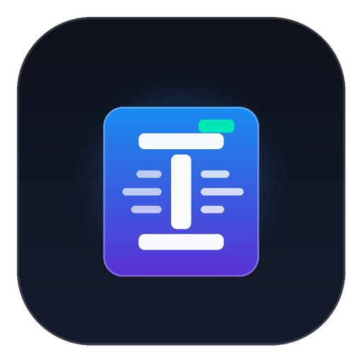
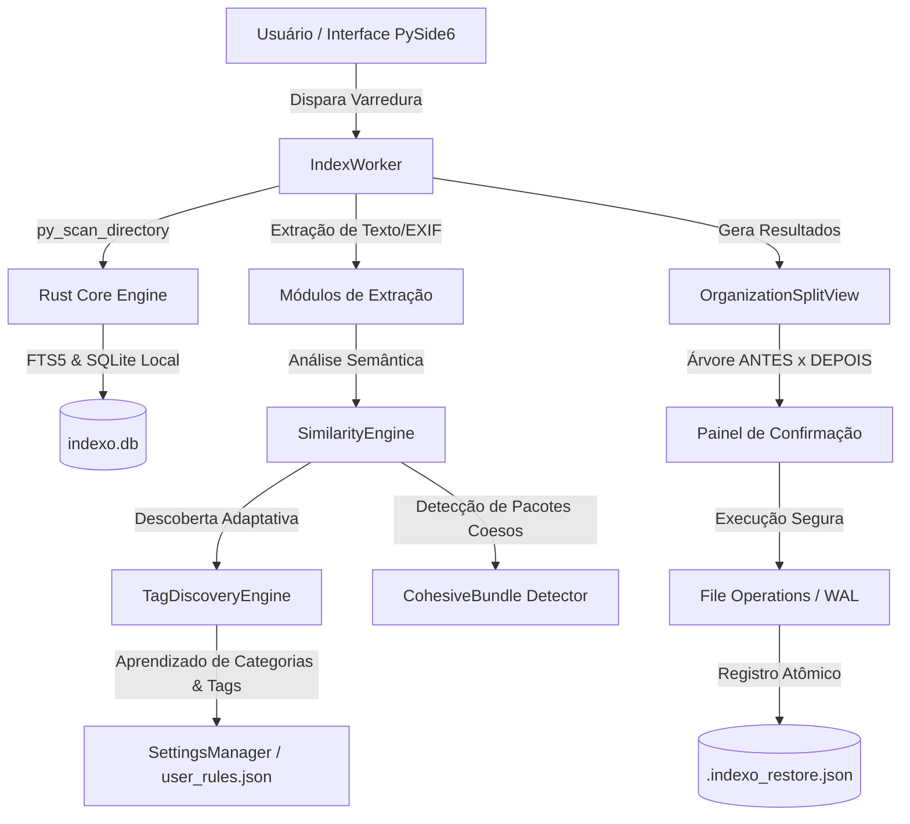

# Indexo — Sistema Inteligente de Organização Semântica de Arquivos

<p align="center">
  
</p>

<p align="center">
  <b>Organizador e indexador de arquivos semântico, inteligente e adaptativo para Windows.</b><br>
  Construído com arquitetura híbrida de alta performance: <b>Rust Core (via PyO3)</b> e interface desktop nativa em <b>Python (PySide6 / Qt)</b>.
</p>

<p align="center">
  
  
  
  
  
</p>

<p align="center">
  <b>Português</b> | <a href="README_EN.md">English</a>
</p>

---

## Sobre o Projeto

Este projeto foi feito com o objetivo de servir como uma introdução prática e aprofundada ao ecossistema **Rust** (programação de sistemas de alta performance, manipulação segura de memória e criação de extensões nativas C/FFI com PyO3) e ao mesmo tempo aperfeiçoar minha técnica em **Python** (desenvolvimento desktop moderno com PySide6/Qt, concorrência assíncrona com QThread/Workers, arquitetura modular e engenharia de testes).

---

## Principais Destaques

* **Inteligência Adaptativa & Zero-Hardcode**: O aplicativo não impõe regras fixas engessadas. Ao ser instalado do zero (`tags: []`), ele analisa o ambiente do usuário e aprende dinamicamente as **Categorias** e **Tags** com base nos padrões reais dos arquivos.
* **Preservação de Pastas Coesas (Jogos, Softwares e Projetos)**: Detecta pacotes funcionais completos (como diretórios de jogos, projetos de código ou instalações) e oferece a movimentação segura da **pasta mãe inteira** para a categoria correspondente, sem espalhar ou renomear arquivos internos essenciais.
* **Hierarquia Estrita de Similaridade**: Avaliação na ordem **1. Nome/Pasta -> 2. Conteúdo/Texto -> 3. Tipo/Formato**.
* **Proteção contra Falsos Positivos & Limiar de Confiança**: Regras de documentos só casam com arquivos que possuam texto real. O usuário configura o limiar de confiança nas preferências (50% a 95%, padrão 65%); arquivos com menor certeza permanecem na origem como pendentes.
* **Desfazer Completo em 1 Clique (WAL)**: Toda movimentação física é registrada atomicamente no log Write-Ahead (`.indexo_restore.json`). A qualquer momento é possível reverter 100% da sessão com restauração fiel.
* **Alta Performance com Rust Core**: Escaneamento de dezenas de milhares de arquivos em milissegundos, extração multithreaded de metadados e busca instantânea `Ctrl+K` via SQLite FTS5.
* **100% Portátil**: Opera sem instaladores invasivos, sem gravar dados no `%APPDATA%` ou no Registro do Windows.

---

## Arquitetura do Sistema

O Indexo utiliza uma arquitetura em camadas para unir o poder de baixo nível do Rust com a flexibilidade da interface PySide6:



---

## Estrutura do Repositório

```text
Indexo/
├── Cargo.toml                  # Workspace Rust master
├── pyproject.toml              # Configuração Python, Maturin, Pytest e Linters
├── rustfmt.toml                # Formatação padrão de código Rust
├── LICENSE                     # Licença GNU General Public License v3.0
├── CHANGELOG.md                # Histórico de alterações e versões (SemVer)
├── README.md                   # Apresentação do projeto e guia do usuário (Português)
├── README_EN.md                # Apresentação do projeto e guia do usuário (Inglês)
│
├── rust-core/                  # Motor nativo em Rust (PyO3)
│   ├── Cargo.toml              # Dependências e otimizações de compilação
│   └── src/
│       ├── lib.rs              # Bindings Python via PyO3
│       ├── indexing/           # Varredura nativa e metadados de arquivos
│       ├── extraction/         # Processamento de texto e hashes seguros
│       ├── classification/     # Kernel de regras e casamento difuso
│       └── utils/              # Validação de caminhos e anti-traversal
│
├── python-app/                 # Aplicação Desktop PySide6
│   ├── main.py                 # Ponto de entrada e Single-Instance Lock
│   └── app/
│       ├── main_window.py      # Janela principal e orquestração de navegação
│       ├── classification/     # Motor de similaridade, descoberta de tags e regras
│       │   ├── similarity_engine.py # Hierarquia Nome -> Conteúdo -> Tipo e pacotes
│       │   ├── tag_discovery.py     # Aprendizado dinâmico de categorias e tags
│       │   └── rule_loader.py       # Carregador de regras mestras e de usuário
│       ├── widgets/            # Componentes visuais da interface
│       │   ├── organization_view.py # Árvore Antes x Depois e painel de pacotes
│       │   ├── tag_manager_view.py  # Gerenciador dinâmico de tags e categorias
│       │   ├── settings_view.py     # Configurações gerais e limiar de confiança
│       │   ├── stats_view.py        # Painel estatístico e volumetria
│       │   └── duplicate_view.py    # Visualizador de duplicatas exatas
│       ├── workers/            # Threads de background (IndexWorker, FileOpsWorker)
│       └── utils/              # Operações de arquivo seguras, WAL e lixeira
│
├── resources/                  # Recursos visuais e internacionalização
│   ├── icon.ico / icon.png     # Ícones da aplicação em alta resolução
│   ├── system_rules.json       # Esquema base de regras semânticas
│   └── i18n/                   # Dicionários dinâmicos (ptBR.json, enUS.json)
│
├── scripts/                    # Automação e utilitários de desenvolvimento
│   ├── dev_run.py              # Inicialização rápida em ambiente de desenvolvimento
│   ├── check.py                # Diagnóstico unificado de integridade e regras
│   ├── build.py                # Pipeline de compilação e empacotamento portátil
│   └── generate_test_dataset.py# Gerador de massa de testes sintética
│
└── Portable-EXE/               # Distribuição portátil consolidada
    └── Indexo-Portable/        # Pacote pronto para execução no Windows
```

---

## Como Funciona o Aprendizado de Categorias e Tags

O Indexo opera sob o princípio de **mínimo hardcode e máxima inteligência adaptativa**:

1. **Topologia de Pastas (Hierarquia Real)**:
   - Estruturas como `Viagens/Praia/foto.jpg` aprendem `Viagens` como a **Categoria** e `Praia` como a **Tag**.
   - Projetos como `Projetos/MeuApp/main.py` geram a Categoria `Projetos` e a Tag `MeuApp`.
2. **Clusterização por Macro-Radicais de Nomes**:
   - Arquivos com prefixos compartilhados (ex: `Fatura_FornecedorA`, `Fatura_FornecedorB`) geram a Categoria `Faturas` e as Tags `FornecedorA`, `FornecedorB`.
   - Documentos como `Relatorio_Vendas_2024` e `Relatorio_Custos_2024` geram a Categoria `Relatórios` e as Tags `Vendas`, `Custos`.
3. **Detecção de Jogos e Softwares (`CohesiveBundle`)**:
   - Pastas com executáveis principais (`.exe`), assets (`.pak`, `.wad`, `.unity3d`) ou bibliotecas de runtime são identificadas como pacotes unitários.
   - O aplicativo move a pasta inteira para `Indexo_Files/Jogos/<NomeDoJogo>/`, preservando a integridade interna de todos os arquivos.
4. **Persistência Contínua**:
   - Toda nova categoria ou tag descoberta é armazenada no arquivo de perfil `user_rules.json` e reaproveitada em sessões futuras.

---

## Como Executar e Desenvolver

### Pré-requisitos

* **Windows 10 ou 11 (64-bit)**
* **Python 3.10+**
* **Rust Toolchain (Cargo 1.75+)**

### 1. Clonar o Repositório

```powershell
git clone https://github.com/seu-usuario/Indexo.git
cd Indexo
```

### 2. Instalar Dependências e Compilar o Rust Core

```powershell
python -m pip install -r python-app/requirements.txt
python -m pip install maturin
maturin develop --manifest-path rust-core/Cargo.toml
```

### 3. Iniciar em Modo de Desenvolvimento

```powershell
python scripts/dev_run.py
```

---

## Verificação e Diagnóstico de Qualidade

Para executar o diagnóstico unificado de integridade de regras semânticas, paridade de internacionalização (i18n) e testes nativos em Rust:

```powershell
python scripts/check.py
```

---

## Gerando a Versão Portátil (Stand-Alone EXE)

Para gerar a compilação de release com módulos nativos otimizados e empacotamento completo:

```powershell
python scripts/build.py
```

O executável portátil autossuficiente será gerado em:
`Portable-EXE/Indexo-Portable/Indexo.exe`

---

## Atalhos de Teclado Úteis

| Atalho | Ação |
| :--- | :--- |
| <kbd>Ctrl</kbd> + <kbd>O</kbd> | Selecionar pasta para varredura e organização |
| <kbd>Ctrl</kbd> + <kbd>K</kbd> | Abertura rápida da Busca Global Semântica |
| <kbd>Ctrl</kbd> + <kbd>Z</kbd> | Desfazer última sessão de organização (Restaurar WAL) |
| <kbd>F5</kbd> | Atualizar visualização e reavaliar diretório atual |
| <kbd>Ctrl</kbd> + <kbd>T</kbd> | Abrir o Gerenciador de Tags e Categorias |
| <kbd>Ctrl</kbd> + <kbd>,</kbd> | Abrir o painel de Configurações |

---

## Licença

Este projeto é software livre e de código aberto, distribuído sob a licença **GNU General Public License v3.0 (GPLv3)**. Consulte o arquivo [LICENSE](LICENSE) para mais detalhes.
