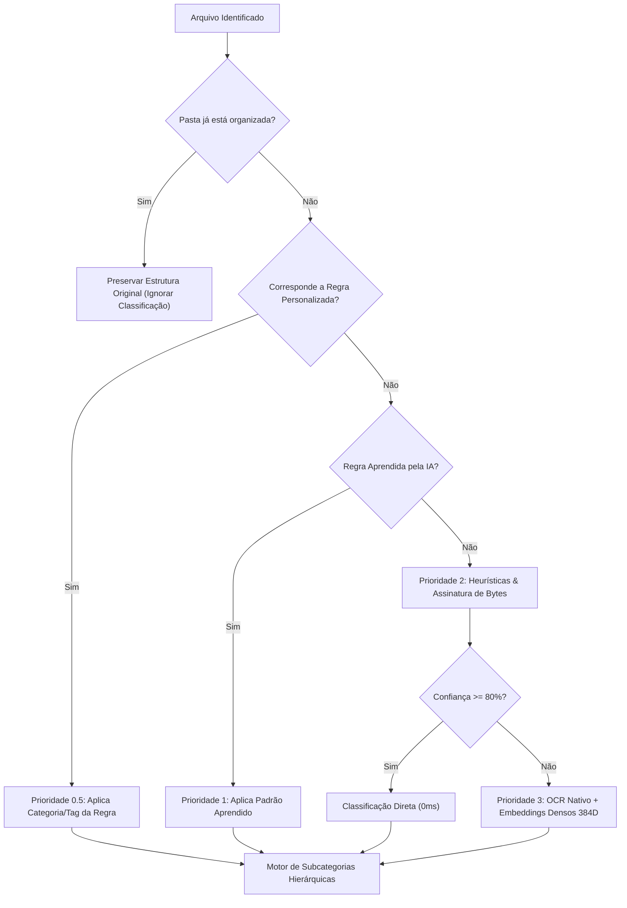

# Indexo — Sistema Inteligente de Organização Semântica de Arquivos

<p align="center">
  
</p>

<p align="center">
  <b>“Index and organize like the library of Alexandria”</b><br>
  Organizador, catalogador e deduplicador semântico de arquivos, inteligente, determinístico, portátil e 100% offline para Windows.<br>
  Construído em <b>Rust nativo (Tauri 2)</b> no backend e <b>Svelte 5 (TypeScript)</b> no frontend sob o tema <b>Biblioteca de Alexandria & Flexoki</b>.
</p>

<p align="center">
  
  
  
  
  
  
</p>

<p align="center">
  <b>Português</b> | <a href="README_EN.md">English</a>
</p>

> [!NOTE]
> **Versão em Python disponível**: Procurando pela versão anterior construída em Python (PySide6 / Qt)? Ela está totalmente preservada, funcional e disponível no repositório dedicado [`Indexo-py`](https://github.com/pongitV/Indexo-py).

---

## Sumário

- [Sobre o Projeto](#sobre-o-projeto)
- [Principais Destaques](#principais-destaques)
- [Motor de Classificação Semântica em 4 Camadas](#motor-de-classificação-semântica-em-4-camadas)
- [Funcionalidades Principais](#funcionalidades-principais)
  - [1. Organização e Pré-visualização Lado a Lado](#1-organização-e-pré-visualização-lado-a-lado)
  - [2. Deduplicador Lado a Lado (View-First)](#2-deduplicador-lado-a-lado-view-first)
  - [3. Construtor de Regras Personalizadas, Padrão e IA](#3-construtor-de-regras-personalizadas-padrão-e-ia)
  - [4. Renomeador Inteligente por Contexto](#4-renomeador-inteligente-por-contexto)
  - [5. Histórico, Árvores Comparativas e Estatísticas](#5-histórico-árvores-comparativas-e-estatísticas)
- [Tema Biblioteca de Alexandria & Flexoki](#tema-biblioteca-de-alexandria--flexoki)
- [Estrutura Completa do Repositório](#estrutura-completa-do-repositório)
- [Como Executar e Desenvolver](#como-executar-e-desenvolver)
- [Gerando o Executável Portátil Standalone](#gerando-o-executável-portátil-standalone)
- [Licença](#licença)

---

## Sobre o Projeto

O **Indexo** é um organizador e catalogador de arquivos projetado para transformar o caos de pastas complexas (como *Downloads*, *Documentos*, *Área de Trabalho* ou diretórios de projetos) em um arquivo pessoal impecável, rápido e transparente.

Inspirado na filosofia da antiga **Biblioteca de Alexandria** e no esquema de cores **Flexoki** de Steph Ango, o Indexo opera sob o princípio de **inteligência adaptativa sem taxonomia pré-definida (zero-hardcode)**: ele analisa o conteúdo real dos arquivos por *magic bytes*, OCR nativo e contexto semântico, sugerindo árvores limpas e organizadas sem mover nada sem aprovação explícita do usuário.

### Pilares Fundamentais:
1. **100% Offline & Privado**: Sem serviços em segundo plano, sem rastreadores, sem telemetria. Tudo roda estritamente sob demanda na sua máquina.
2. **Alta Performance em Rust**: Backend compilado em **Rust 2021** com paralelismo nativo via `rayon`, processando dezenas de milhares de arquivos com velocidade instantânea e baixo consumo de memória.
3. **Interface Reativa em Svelte 5**: Frontend moderno em TypeScript, barra de navegação compacta com dropdowns agrupados, navegação por teclado e visualizações fluidas.
4. **Segurança Absoluta (Zero Risco de Perda de Dados)**: Arquivos são movidos de forma transacional com trilha de auditoria completa para **desfazer (undo) em 1 clique**. O deduplicador envia itens para a Lixeira do Windows por padrão.

---

## Principais Destaques

* **OCR Nativo de Imagens e Scans (`Windows.Media.Ocr`)**: Lê texto de comprovantes, prints e fotos sem downloads pesados ou APIs externas.
* **Detecção e Preservação de Pastas Já Organizadas**: Pastas coerentes são identificadas no primeiro passo e ignoradas pelo classificador para não criar poluição de categorias.
* **Deduplicador View-First com Hashing em 3 Estágios**: Identifica arquivos duplicados exatos agrupando por tamanho $\rightarrow$ hash de prefixo 64KB $\rightarrow$ SHA-256 completo, com comparação visual lado a lado e envio para a Lixeira do Windows.
* **Gerenciador de Regras (Personalizadas, Padrão e IA)**: Construtor visual de condições (*SE [campo] [operador] [valor] ENTÃO [ação]*), explorador de heurísticas embutidas e catálogo de regras aprendidas pela IA.
* **Painel de Histórico & Estatísticas de Armazenamento**: Visualizador de árvores comparativas lado a lado para cada sessão passada, métricas de espaço economizado e distribuição de categorias.
* **Tema Biblioteca de Alexandria & Flexoki**: Fundo claro em tom de **página de livro antiga / pergaminho bege** e modo noturno em carvão-tinta com realces em Terracota e Âmbar Antigo.

---

## Motor de Classificação Semântica em 4 Camadas



1. **Prioridade 0 — Pastas Já Organizadas**: Identifica diretórios com estrutura temática coerente e preserva a árvore original.
2. **Prioridade 0.5 — Regras Personalizadas do Usuário**: Avalia regras condicionais configuradas no Construtor de Regras antes de qualquer heurística.
3. **Prioridade 1 — Regras Aprendidas pela IA**: Consulta o histórico de correções manuais do usuário armazenado no SQLite local (`data/profile.db`).
4. **Prioridade 2 — Heurísticas Nativas & Magic Numbers**: Detecção de tipo real por bytes (`infer`), documentos financeiros, desenvolvimento, mídias e arquivos compactados.
5. **Prioridade 3 — OCR Nativo & Embeddings Semânticos**: Extração de texto via `Windows.Media.Ocr`, `pdf-extract`, `docx-rs` e clusterização vetorial contínua.

---

## Funcionalidades Principais

### 1. Organização e Pré-visualização Lado a Lado
* Arraste qualquer pasta ou use o botão de seleção.
* Visualize a árvore **Original x Proposta** antes de realizar qualquer modificação no disco.
* Suporte a seleção múltipla (`Ctrl+Clique` e `Shift+Clique`) com barra flutuante de ações em lote para alterar categorias, tags ou ignorar arquivos.

### 2. Deduplicador Lado a Lado (View-First)
* Escaneamento ultra-rápido em 3 estágios (Tamanho $\rightarrow$ Prefixo 64KB $\rightarrow$ SHA-256).
* Cards comparativos lado a lado com miniatura, resolução em pixels, data de modificação e caminho.
* Sugestão inteligente de qual arquivo manter (*Melhor nome limpo*, *Maior resolução*, *Mais recente*).
* Descarte seguro enviando itens para a **Lixeira do Windows** ou exclusão permanente opcional.

### 3. Construtor de Regras, Heurísticas Padrão (Editáveis) e Aprendizado por IA
* **Edição Completa de Heurísticas Padrão**: Personalize extensões reconhecidas, subpastas ativas, modo de agrupamento (`Auto`, `Por Ano`, etc.) e palavras-chave de cada categoria nativa do sistema (`Media`, `Executaveis`, `Documentos`, `Projetos`, etc.).
* **Restauração Granular por Seção & Global**: Reverta apenas as extensões, apenas as subpastas ou restaure toda a categoria ou todo o catálogo de fábrica com 1 clique.
* **Construtor Visual de Regras Personalizadas**: Crie regras condicionais prioritárias (*SE [campo] [operador] [valor] ENTÃO [ação]*).
* **Auditoria de Regras Aprendidas por IA**: O Indexo aprende automaticamente a partir de correções manuais no Preview ou no modal de Não-Identificados, sem nada fixo no código.

### 4. Taxonomia Padronizada Sem Espaços & Subpastas Especializadas
* Organização estrita usando hífens em vez de espaços:
  - `Media/Imagens-Fotografias`, `Media/Videos-Gravacoes`, `Media/Audios-Musicas`
  - `Executaveis/Jogos-Emuladores-ROMs` (com subpastas dedicadas para *Nintendo-NES*, *Super-Nintendo-SNES*, *Nintendo-64*, *Nintendo-Switch*, *PlayStation*, *Sega*, etc.), `Executaveis/Aplicativos-Utilitarios`, `Executaveis/Instaladores-Setups`
  - `Documentos/Fiscais-Pessoais`, `Documentos/Trabalho`, `Documentos/Estudos`
  - `Projetos/Repositorios-GitHub`, `Projetos/Repositorios-Locais`, `Projetos/Modelos-3D-CAD`, `Projetos/Scripts-Automacoes`

### 5. Renomeador Inteligente por Contexto
* Padronização em lote removendo prefixos de câmeras e mensageiros (`IMG_`, `WA_`, `Scan_`).
* Sugestão automática de nomes claros com datas formatadas e herança do contexto da pasta.
* Histórico completo de renomeações prévias com restauração direta.

### 6. Histórico, Árvores Comparativas e Estatísticas
* Registro cronológico de todas as organizações e renomeações realizadas com botão de **Desfazer (Undo)**.
* 3 visualizações por sessão: **Árvore Proposta**, **Categorias Criadas**, **Tags Criadas** e **Arquivos Movidos**.
* Painel de **Estatísticas & Armazenamento**: Total de espaço organizado, contagem de arquivos e gráficos de volume.
* **Redefinição Total de Dados com Confirmação Segura**: Opção nas Configurações para zerar o banco de dados e perfis locais digitando `"sim"`.

---

## Tema Biblioteca de Alexandria & Flexoki

O design e a paleta de cores do Indexo foram inspirados no esquema de cores **[Flexoki](https://stephango.com/flexoki)** (criado por [Steph Ango](https://stephango.com/)), projetado especificamente para leitura confortável em prosa e código, combinado com a atmosfera de manuscritos e encadernações da clássica Biblioteca de Alexandria:

* **Inspiração de Cores ([Flexoki](https://stephango.com/flexoki))**: Paleta de tintas com contraste térmico balanceado para minimizar a fadiga ocular em sessões de organização de arquivos.
* **Modo Claro (*Alexandria Day*)**:
  - Fundo em **Bege de Página de Livro Antiga** (`#EFE5D3` / `#E4D8C2`).
  - Tipografia em **Tinta Sépia/Carvão Profunda** (`#211912`).
  - Realces em **Terracota / Couro Encadernado** (`#BC5215`).
* **Modo Escuro (*Alexandria Night*)**:
  - Fundo em **Carvão e Tinta Quente** (`#100F0F` / `#1C1B1A`).
  - Tipografia em **Pergaminho Suave** (`#CECDC3`).
  - Realces em **Âmbar Dourado / Terracota Luminoso** (`#DA702C`).
* **Easter Egg da Biblioteca de Alexandria**: Clique no logo do Indexo no menu superior para abrir o modal especial com o ratinho acenando e a síntese da filosofia do aplicativo.

---

## Estrutura Completa do Repositório

```text
Indexo/
├── index.html                      # Ponto de entrada HTML com favicon SVG de Alexandria
├── package.json                    # Scripts do frontend Vite / Tauri
├── tsconfig.json                   # Configuração TypeScript
├── vite.config.ts                  # Configuração Vite
├── README.md                       # Documentação em Português
├── README_EN.md                    # Documentação em Inglês
├── LICENSE                         # Licença GNU GPLv3
│
├── assets/                         # Mídias e demonstrações
│   └── alexandria_mouse.gif        # Animação do ícone da Biblioteca de Alexandria
│
├── src/                            # Frontend em Svelte 5 + TypeScript
│   ├── App.svelte                  # Orquestrador de rotas, navegação em dropdown e Easter Egg
│   ├── routes/
│   │   ├── FolderSelect.svelte     # Janela limpa de seleção de diretório e toggle
│   │   ├── Scanning.svelte         # Varredura e feedback em tempo real
│   │   ├── Preview.svelte          # Árvore comparativa lado a lado e barra de ações em lote
│   │   ├── Renamer.svelte          # Renomeador inteligente em lote
│   │   ├── Duplicates.svelte       # Deduplicador view-first lado a lado
│   │   ├── RulesManager.svelte     # Construtor de regras personalizadas, padrão e IA
│   │   ├── History.svelte          # Histórico com árvores lado a lado e estatísticas
│   │   ├── TagManager.svelte       # Gerenciador de tags semânticas
│   │   ├── CategoryManager.svelte  # Gerenciador de categorias e pastas destino
│   │   └── Settings.svelte         # Configurações de tema, idioma e manutenção
│   │
│   ├── lib/
│   │   ├── api.ts                  # Clientes tipados para comandos Tauri
│   │   ├── stores.ts               # Estado reativo global
│   │   ├── FileTreeNode.svelte     # Nós da árvore interativa com multi-seleção
│   │   └── ...                     # Modais de auditoria, preview e histórico
│   │
│   └── styles/
│       └── theme.css               # Design tokens do tema Biblioteca de Alexandria / Flexoki
│
└── src-tauri/                      # Backend nativo em Rust 2021 (Tauri 2)
    ├── Cargo.toml                  # Dependências Rust
    ├── tauri.conf.json             # Configurações Tauri 2
    ├── icons/                      # Ícones multiplataforma (.ico, .png)
    └── src/
        ├── main.rs                 # Ponto de entrada e registro de comandos
        ├── commands/               # Handlers de scan, classify, duplicates, rules, history
        ├── engine/                 # Classificação em 4 camadas, OCR, embeddings, duplicatas
        └── db/                     # Camada SQLite local (data/profile.db em WAL mode)
```

---

## Como Executar e Desenvolver

### Pré-requisitos
* **Windows 10 ou 11 (64-bit)**
* **Rust Toolchain** (`rustc` e `cargo` instalados via [rustup.rs](https://rustup.rs))
* **Node.js 18+** e **npm** ([nodejs.org](https://nodejs.org))

### 1. Clonar e Instalar

```powershell
git clone https://github.com/pongitV/Indexo.git
cd Indexo
npm install
```

### 2. Executar em Modo de Desenvolvimento

```powershell
npm run tauri dev
```

---

## Gerando o Executável Portátil Standalone

Para compilar a versão final otimizada em release:

```powershell
npm run tauri build
```

Os artefatos finais serão gerados em:
* **Executável Portátil Standalone**: `src-tauri/target/release/indexo.exe`
* **Instalador NSIS**: `src-tauri/target/release/bundle/nsis/Indexo_0.1.0_x64-setup.exe`

---

## Licença

Distribuído sob a licença **GNU General Public License v3.0 (GPLv3)**. Consulte o arquivo [LICENSE](LICENSE) para mais informações.
