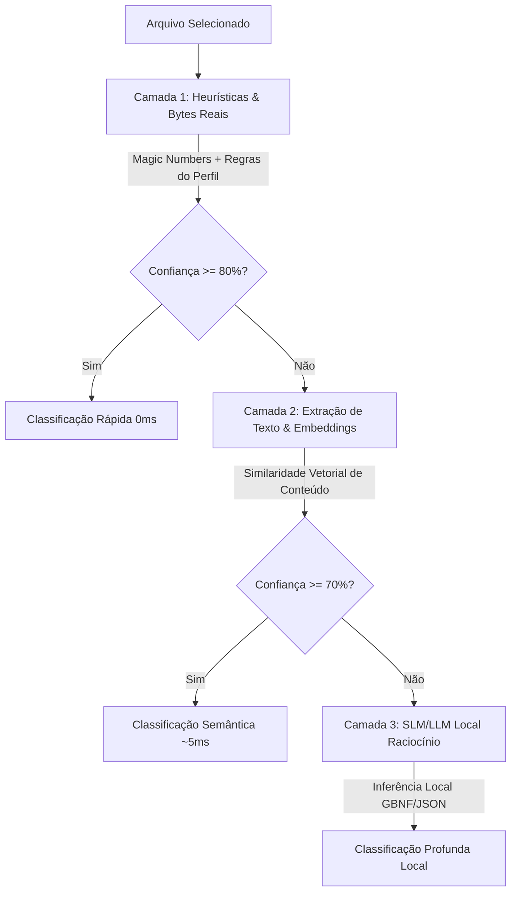
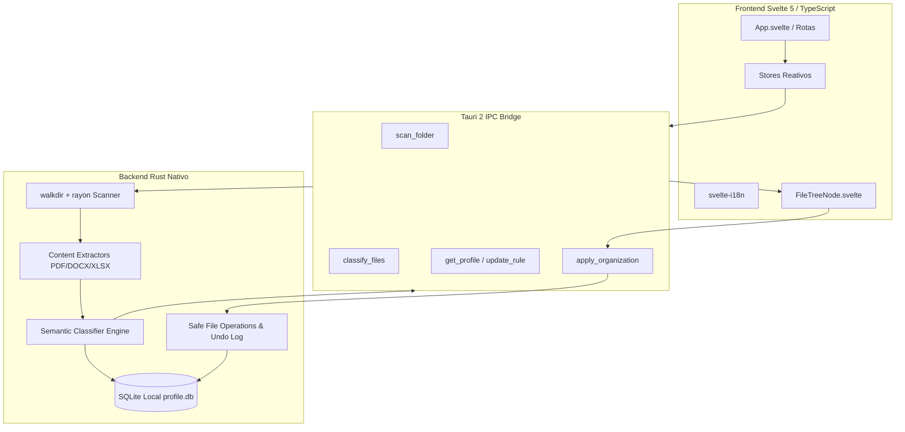

# Indexo — Sistema Inteligente de Organização Semântica de Arquivos

<p align="center">
  
</p>

<p align="center">
  <b>Organizador e indexador de arquivos semântico, inteligente, portátil e 100% offline para Windows.</b><br>
  Construído com arquitetura de alta performance: <b>Rust nativo (Tauri 2)</b> no backend e <b>Svelte 5 (TypeScript)</b> no frontend.
</p>

<p align="center">
  
  
  
  
  
  
</p>

<p align="center">
  <b>Português</b> | <a href="README_EN.md">English</a>
</p>

> [!NOTE]
> **Versão em Python disponível**: Procurando pela versão anterior construída em Python (PySide6 / Qt)? Ela está totalmente preservada, funcional e documentada na branch [`Indexo-py`](https://github.com/pongitV/Indexo/tree/Indexo-py).

---

## 📑 Sumário

- [Sobre o Projeto](#-sobre-o-projeto)
- [Principais Destaques](#-principais-destaques)
- [Motor de Classificação Semântica em 3 Camadas](#-motor-de-classificação-semântica-em-3-camadas)
- [Arquitetura do Sistema](#-arquitetura-do-sistema)
- [Estrutura Completa do Repositório](#-estrutura-completa-do-repositório)
- [Fluxo de Experiência do Usuário (UI/UX)](#-fluxo-de-experiência-do-usuário-uiux)
- [Como Executar e Desenvolver](#-como-executar-e-desenvolver)
- [Gerando o Executável Portátil Standalone](#-gerando-o-executável-portátil-standalone)
- [Roteiro e Especificação de Implementação](#-roteiro-e-especificação-de-implementação)
- [Licença](#-licença)

---

## 💡 Sobre o Projeto

O **Indexo** é um organizador e classificador semântico de arquivos projetado para resolver a desordem crônica de diretórios complexos no Windows (como pastas *Downloads*, *Documentos*, *Área de Trabalho* ou coleções de projetos). 

Diferente de organizadores tradicionais baseados em extensões fixas ou regras manuais rígidas, o Indexo opera sob o princípio de **inteligência adaptativa sem taxonomia pré-definida (zero-hardcode)**: ele analisa o conteúdo real dos arquivos (inspecionando *magic numbers*, extraindo textos de PDFs/Office e avaliando similaridade semântica) e agrupa tudo dinamicamente em categorias legíveis e naturais.

### 🌟 Pilares Fundamentais:
1. **100% Offline & Privado**: Nenhum arquivo, metadado ou dado de telemetria sai da máquina do usuário.
2. **Alta Performance & Baixo Consumo**: Backend compilado em **Rust 2021** com paralelismo real via `rayon`, processando milhares de arquivos sem travamentos e consumindo mínima memória RAM.
3. **Interface Moderna & Reativa**: Frontend construído com **Svelte 5** e **TypeScript**, proporcionando uma experiência desktop fluida, suporte a temas (claro/escuro) e internacionalização (pt-BR / en-US).
4. **Segurança Absoluta (Zero Risco de Perda de Dados)**: Arquivos nunca são deletados automaticamente — apenas organizados após confirmação visual lado a lado, sempre acompanhados de histórico transacional para **desfazer (undo) em 1 clique**.

---

## ✨ Principais Destaques

* 🧠 **Zero-Hardcode & Categorização Dinâmica**: O aplicativo não impõe regras engessadas de fábrica. As categorias e tags são sintetizadas em tempo real a partir dos arquivos reais do usuário.
* 🔍 **Inspeção Real de Conteúdo**: Não confia cegamente em extensões declaradas. Detecta o formato real pelos bytes de cabeçalho (*magic numbers*) e extrai texto de PDFs, DOCX, XLSX, TXT, MD e CSV.
* 📊 **Pré-visualização Lado a Lado (Antes x Depois)**: Comparação visual clara entre a estrutura original e a proposta de destino antes de qualquer operação no disco.
* 🖱️ **Aprendizado Incremental por Correção Manual**: Permite corrigir classificações com o botão direito (alterar categoria, criar nova tag, criar regra permanente). Cada correção alimenta o banco SQLite local (`data/profile.db`), aprimorando classificações futuras.
* 🔄 **Reversão Completa de Sessão (Undo)**: Trilha de auditoria transacional para reverter qualquer organização com restauração precisa.
* 📦 **100% Portátil (.exe Standalone)**: Roda diretamente sem instalador, sem tocar no `%APPDATA%` ou no Registro do Windows. Copiar a pasta do executável copia todo o perfil de aprendizado.

---

## 🧠 Motor de Classificação Semântica em 3 Camadas

O pipeline de classificação do Indexo avalia cada arquivo em três camadas hierárquicas em cascata:



1. **Camada 1 — Heurísticas e Assinaturas Reais de Bytes (`0ms`)**:
   - Detecção do MIME-type real através de *magic numbers* via `infer`.
   - Consulta ao banco local de regras personalizadas e histórico de correções do usuário (`profile.db`).
2. **Camada 2 — Extração Textual & Similaridade Vetorial (`~5ms`)**:
   - Extração de texto representativo de documentos (`pdf-extract`, `docx-rs`, `calamine`).
   - Cálculo de similaridade semântica por embeddings vetoriais locais para agrupamento por proximidade de conteúdo.
3. **Camada 3 — Raciocínio Profundo com SLM Local**:
   - Ativado para arquivos altamente ambíguos ou não estruturados, processando o contexto localmente sem dependência de internet.

---

## 🏛️ Arquitetura do Sistema



---

## 📂 Estrutura Completa do Repositório

```text
Indexo/
├── index.html                      # Ponto de entrada HTML do frontend Vite
├── package.json                    # Dependências e scripts do frontend Svelte 5 / Tauri
├── package-lock.json               # Trava de dependências Node.js
├── tsconfig.json                   # Configuração do compilador TypeScript
├── vite.config.ts                  # Configuração do Vite e plugin Svelte
├── PLANO_IMPLEMENTACAO.md          # Especificação técnica completa e plano de desenvolvimento
├── README.md                       # Apresentação do projeto e guia do usuário (Português)
├── README_EN.md                    # Apresentação do projeto e guia do usuário (Inglês)
├── LICENSE                         # Licença GNU General Public License v3.0
├── .gitignore                      # Regras de exclusão do Git
│
├── src/                            # Frontend em Svelte 5 + TypeScript
│   ├── main.ts                     # Inicialização da aplicação Svelte
│   ├── App.svelte                  # Componente raiz e orquestrador de navegação
│   │
│   ├── lib/                        # Módulos compartilhados e bibliotecas
│   │   ├── api.ts                  # Clientes e chamadas tipadas para comandos Tauri
│   │   ├── stores.ts               # Gerenciamento de estado reativo global (Svelte stores)
│   │   ├── FileTreeNode.svelte     # Componente da árvore visual de arquivos
│   │   └── i18n/                   # Dicionários de internacionalização
│   │       ├── pt-BR.json          # Português do Brasil
│   │       └── en-US.json          # Inglês Americano
│   │
│   ├── routes/                     # Telas e fluxos da aplicação
│   │   ├── FolderSelect.svelte     # Tela inicial com seleção e drag-and-drop de pastas
│   │   ├── Scanning.svelte         # Tela de progresso de varredura e extração
│   │   ├── Preview.svelte          # Tela principal de pré-visualização (Antes x Depois)
│   │   ├── Settings.svelte         # Painel de configurações (tema, idioma, limites)
│   │   └── TagManager.svelte       # Gerenciador de tags, regras e categorias aprendidas
│   │
│   ├── i18n/                       # Configuração de internacionalização (svelte-i18n)
│   │   └── setup.ts                # Inicialização e detecção do idioma do sistema
│   │
│   └── styles/                     # Estilização global
│       └── theme.css               # Design system, tokens de cores e modo escuro/claro
│
├── src-tauri/                      # Backend nativo em Rust (Tauri 2)
│   ├── Cargo.toml                  # Manifesto de dependências Rust (tauri, tokio, rusqlite, rayon, sha2)
│   ├── Cargo.lock                  # Trava de dependências Rust
│   ├── build.rs                    # Script de compilação Tauri
│   ├── tauri.conf.json             # Configurações do runtime Tauri 2 e janelas
│   │
│   ├── src/                        # Código-fonte Rust
│   │   ├── main.rs                 # Ponto de entrada do executável e registro de comandos
│   │   │
│   │   ├── commands/               # Handlers de comandos invocados pelo frontend
│   │   │   ├── mod.rs              # Exportação dos módulos de comandos
│   │   │   ├── scan.rs             # Comando de varredura recursiva de diretórios
│   │   │   ├── classify.rs         # Comando de classificação semântica em lote
│   │   │   ├── apply.rs            # Comando de movimentação de arquivos e geração de log
│   │   │   └── profile.rs          # Comando de consulta e persistência de perfil
│   │   │
│   │   ├── engine/                 # Núcleo do motor de inteligência e classificação
│   │   │   ├── mod.rs              # Orquestrador do pipeline de classificação
│   │   │   ├── heuristics.rs       # Camada 1: Heurísticas, extensões e magic numbers
│   │   │   ├── content_extract.rs  # Extração de texto de PDF, DOCX, XLSX e texto puro
│   │   │   ├── embeddings.rs       # Camada 2: Embeddings vetoriais e similaridade de cosseno
│   │   │   ├── llm_local.rs        # Camada 3: Inferência local com SLMs/LLMs
│   │   │   └── rules.rs            # Avaliador e sintetizador dinâmico de regras
│   │   │
│   │   ├── fs_ops/                 # Operações no sistema de arquivos e segurança
│   │   │   ├── mod.rs              # Tratamento de caminhos e prevenção anti-traversal
│   │   │   └── mover.rs            # Movimentação atômica, resolução de colisão e rollback
│   │   │
│   │   └── db/                     # Camada de banco de dados SQLite local
│   │       ├── mod.rs              # Conexão e transações com data/profile.db
│   │       ├── models.rs           # Estruturas de dados (Tag, Category, Rule, ActionLog)
│   │       └── schema.sql          # Esquema relacional inicial com tabelas e índices
│   │
│   ├── capabilities/               # Políticas de segurança e permissões do Tauri 2
│   │   └── default.json            # Permissões de diálogo, sistema de arquivos e IPC
│   │
│   └── icons/                      # Ícones da aplicação em múltiplos formatos
│       ├── icon.ico                # Ícone do executável Windows
│       ├── icon.png                # Ícone padrão em alta resolução
│       └── ...                     # Ícones para resoluções variadas
│
└── data/                           # Diretório de persistência local (criado em runtime)
    └── profile.db                  # Banco SQLite do perfil de aprendizado do usuário
```

---

## 🖥️ Fluxo de Experiência do Usuário (UI/UX)

1. **Seleção de Pasta**: O usuário abre o aplicativo e seleciona ou arrasta a pasta de origem.
2. **Varredura e Extração**: O motor em Rust varre subpastas em paralelo, detecta *magic numbers* e extrai textos em milissegundos, com feedback de progresso na tela.
3. **Pré-visualização Interativa**: A tela exibe a árvore **Antes x Depois**. O usuário pode inspecionar destinos, expandir pastas e ajustar classificações pelo menu de contexto.
4. **Aplicação com Segurança**: Ao clicar em **Aplicar**, os arquivos são movidos atomicamente para a nova estrutura organizada, gerando a trilha de reversão.
5. **Desfazer em 1 Clique**: A qualquer momento, o botão **Desfazer (Undo)** reverte a última sessão de movimentação de forma integral.

---

## 🚀 Como Executar e Desenvolver

### Pré-requisitos
* **Windows 10 ou 11 (64-bit)**
* **Rust Toolchain** (`rustc` e `cargo` instalados via [rustup.rs](https://rustup.rs))
* **Node.js 18+** e **npm** ([nodejs.org](https://nodejs.org))

### 1. Clonar o Repositório

```powershell
git clone https://github.com/pongitV/Indexo.git
cd Indexo
```

### 2. Instalar Dependências do Frontend

```powershell
npm install
```

### 3. Executar em Modo de Desenvolvimento

```powershell
npm run tauri dev
```

Este comando iniciará o servidor de desenvolvimento Vite e a janela nativa do Tauri conectada ao backend Rust com *Hot Module Replacement (HMR)*.

---

## 📦 Gerando o Executável Portátil Standalone

Para compilar a aplicação em modo release otimizado e gerar o `.exe` autônomo:

```powershell
npm run tauri build
```

O binário portátil standalone será gerado em:
`src-tauri/target/release/indexo.exe`

> Este arquivo é 100% autossuficiente: basta copiar o `indexo.exe` para qualquer pasta ou pendrive e executá-lo diretamente.

---

## 📋 Roteiro e Especificação de Implementação

O projeto conta com uma especificação técnica minuciosa detalhada no arquivo [PLANO_IMPLEMENTACAO.md](PLANO_IMPLEMENTACAO.md):

* **Fase 0**: Fundação da stack (Rust + Tauri 2 + Svelte 5 + SQLite `profile.db`).
* **Fase 1**: Extração de conteúdo e motor heurístico de classificação semântica.
* **Fase 2**: Interface reativa, árvore de pré-visualização lado a lado e fluxo de aprovação.
* **Fase 3**: Movimentação física segura, reversão transacional (Undo) e empacotamento portátil.

---

## 📄 Licença

Este projeto é software livre e de código aberto, distribuído sob a licença **GNU General Public License v3.0 (GPLv3)**. Consulte o arquivo [LICENSE](LICENSE) para mais detalhes.
