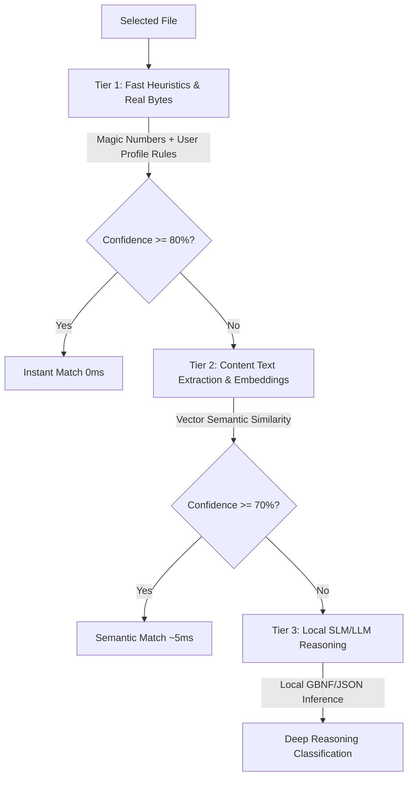
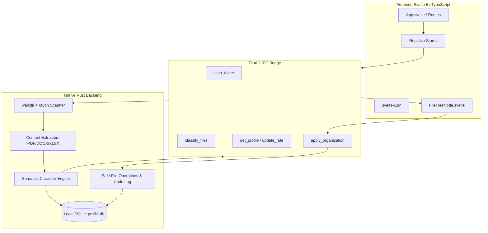

# Indexo — Intelligent Semantic File Organization System

<p align="center">
  
</p>

<p align="center">
  <b>Semantic, intelligent, portable, and 100% offline file organizer and indexer for Windows.</b><br>
  Built with a high-performance architecture: <b>Native Rust (Tauri 2)</b> backend and <b>Svelte 5 (TypeScript)</b> frontend.
</p>

<p align="center">
  
  
  
  
  
  
</p>

<p align="center">
  <a href="README.md">Português</a> | <b>English</b>
</p>

> [!NOTE]
> **Python version available**: Looking for the previous implementation built in Python (PySide6 / Qt)? It is fully preserved, functional, and documented on the [`Indexo-py`](https://github.com/pongitV/Indexo/tree/Indexo-py) branch.

---

## 📑 Table of Contents

- [About the Project](#-about-the-project)
- [Key Highlights](#-key-highlights)
- [3-Tier Semantic Classification Engine](#-3-tier-semantic-classification-engine)
- [System Architecture](#-system-architecture)
- [Complete Repository Structure](#-complete-repository-structure)
- [User Experience Flow (UI/UX)](#-user-experience-flow-uiux)
- [Getting Started & Development](#-getting-started--development)
- [Building the Standalone Portable Executable](#-building-the-standalone-portable-executable)
- [Implementation Roadmap and Specification](#-implementation-roadmap-and-specification)
- [License](#-license)

---

## 💡 About the Project

**Indexo** is a semantic file organizer and classifier engineered to resolve chronic clutter across complex Windows directory structures (such as *Downloads*, *Documents*, *Desktop*, or scattered project folders).

Unlike conventional file organizers that rely on fixed extensions or rigid manual rules, Indexo operates under the principle of **adaptive intelligence without predefined taxonomies (zero-hardcode)**: it analyzes the genuine content of files (inspecting *magic numbers*, extracting text from PDFs/Office files, and evaluating semantic similarity) and dynamically clusters files into natural, human-readable categories.

### 🌟 Core Principles:
1. **100% Offline & Private**: Zero user data, metadata, or telemetry ever leaves your machine.
2. **High Performance & Low Memory Footprint**: Backend compiled in **Rust 2021** with true multithreading via `rayon`, scanning thousands of files seamlessly with minimal RAM consumption.
3. **Modern & Reactive UI**: Frontend built with **Svelte 5** and **TypeScript**, providing a fluid desktop experience, theme switching (dark/light), and internationalization (pt-BR / en-US).
4. **Absolute Safety (Zero Data Loss Risk)**: Files are never deleted automatically — only moved after interactive side-by-side visual inspection, accompanied by a transactional log for **1-click undo**.

---

## ✨ Key Highlights

* 🧠 **Zero-Hardcode & Dynamic Categorization**: No static factory taxonomies. Categories and tags are synthesized in real-time based on the user's actual files.
* 🔍 **Genuine Content Inspection**: Never trusts declared file extensions blindly. Identifies authentic formats via header bytes (*magic numbers*) and extracts text from PDF, DOCX, XLSX, TXT, MD, and CSV.
* 📊 **Side-by-Side Visual Preview (Before vs. After)**: Clear visual comparison between current directory trees and proposed target paths before any filesystem operation occurs.
* 🖱️ **Incremental Learning via Manual Corrections**: Correct any classification with right-click context actions (change category, create new tag, create permanent rule). Every correction updates the local SQLite profile (`data/profile.db`), enhancing future classification accuracy.
* 🔄 **Full Session Reversion (Undo)**: Transactional audit log allows users to revert any completed organization session with complete precision.
* 📦 **100% Portable (.exe Standalone)**: Operates standalone without installers, registry keys, or `%APPDATA%` pollution. Moving the application folder preserves the entire learned profile.

---

## 🧠 3-Tier Semantic Classification Engine

Indexo evaluates every file through a 3-tier hierarchical cascaded pipeline:



1. **Tier 1 — Fast Heuristics and Magic Numbers (`0ms`)**:
   - Real MIME-type detection using file signatures via `infer`.
   - Matching against the local database of user-defined rules and historical corrections (`profile.db`).
2. **Tier 2 — Text Extraction & Vector Similarity (`~5ms`)**:
   - Extraction of representative text from documents (`pdf-extract`, `docx-rs`, `calamine`).
   - Semantic similarity calculation using normalized local embeddings for clustering related content.
3. **Tier 3 — Deep Reasoning with Local SLM**:
   - Engaged for highly ambiguous or unstructured files, executing locally on CPU with zero internet reliance.

---

## 🏛️ System Architecture



---

## 📂 Complete Repository Structure

```text
Indexo/
├── index.html                      # Frontend HTML entrypoint for Vite
├── package.json                    # Svelte 5 / Tauri frontend dependencies and scripts
├── package-lock.json               # Node.js lockfile
├── tsconfig.json                   # TypeScript compiler configuration
├── vite.config.ts                  # Vite bundler and Svelte plugin configuration
├── PLANO_IMPLEMENTACAO.md          # Technical specifications and development plan
├── README.md                       # Project overview and user guide (Portuguese)
├── README_EN.md                    # Project overview and user guide (English)
├── LICENSE                         # GNU General Public License v3.0
├── .gitignore                      # Git exclusion rules
│
├── src/                            # Svelte 5 + TypeScript Frontend
│   ├── main.ts                     # Svelte application initialization
│   ├── App.svelte                  # Root component and navigation orchestrator
│   │
│   ├── lib/                        # Shared libraries and visual modules
│   │   ├── api.ts                  # Typed client wrappers for Tauri backend commands
│   │   ├── stores.ts               # Global reactive state management (Svelte stores)
│   │   ├── FileTreeNode.svelte     # Visual directory tree component
│   │   └── i18n/                   # Translation dictionaries
│   │       ├── pt-BR.json          # Brazilian Portuguese
│   │       └── en-US.json          # American English
│   │
│   ├── routes/                     # Screen views and application flows
│   │   ├── FolderSelect.svelte     # Landing view with folder selection & drag-and-drop
│   │   ├── Scanning.svelte         # Directory scan and extraction progress view
│   │   ├── Preview.svelte          # Main side-by-side (Before vs. After) preview tree
│   │   ├── Settings.svelte         # Settings panel (theme, language, thresholds)
│   │   └── TagManager.svelte       # Tag, category, and learned rule management
│   │
│   ├── i18n/                       # Internationalization setup (svelte-i18n)
│   │   └── setup.ts                # Locale detection and dictionary loader
│   │
│   └── styles/                     # Global styling
│       └── theme.css               # Design system, color tokens, and theme styles
│
├── src-tauri/                      # Native Rust Backend (Tauri 2)
│   ├── Cargo.toml                  # Rust dependencies (tauri, tokio, rusqlite, rayon, sha2)
│   ├── Cargo.lock                  # Rust dependency lockfile
│   ├── build.rs                    # Tauri build hook script
│   ├── tauri.conf.json             # Tauri 2 runtime and window configuration
│   │
│   ├── src/                        # Rust source code
│   │   ├── main.rs                 # Executable entrypoint and command registry
│   │   │
│   │   ├── commands/               # Command handlers invoked by frontend IPC
│   │   │   ├── mod.rs              # Command module exports
│   │   │   ├── scan.rs             # Recursive directory scanner command
│   │   │   ├── classify.rs         # Batch semantic classification command
│   │   │   ├── apply.rs            # Physical move command and undo logger
│   │   │   └── profile.rs          # Profile querying and persistence command
│   │   │
│   │   ├── engine/                 # Intelligence and classification engine
│   │   │   ├── mod.rs              # Classification pipeline orchestrator
│   │   │   ├── heuristics.rs       # Tier 1: Heuristics, extensions, and magic numbers
│   │   │   ├── content_extract.rs  # Text extraction from PDF, DOCX, XLSX, and TXT
│   │   │   ├── embeddings.rs       # Tier 2: Vector embeddings and cosine similarity
│   │   │   ├── llm_local.rs        # Tier 3: Local SLM/LLM inference
│   │   │   └── rules.rs            # Rule evaluator and dynamic synthesizer
│   │   │
│   │   ├── fs_ops/                 # Filesystem operations and security
│   │   │   ├── mod.rs              # Path sanitization and anti-traversal guards
│   │   │   └── mover.rs            # Atomic move, collision resolution, and rollback
│   │   │
│   │   └── db/                     # Local SQLite database layer
│   │       ├── mod.rs              # Database connection and transactions (data/profile.db)
│   │       ├── models.rs           # Data structures (Tag, Category, Rule, ActionLog)
│   │       └── schema.sql          # Initial relational database schema and indices
│   │
│   ├── capabilities/               # Tauri 2 security policies and permissions
│   │   └── default.json            # Dialog, filesystem, and IPC capability grants
│   │
│   └── icons/                      # Application icons in multiple resolutions
│       ├── icon.ico                # Windows executable icon
│       ├── icon.png                # High-resolution standard icon
│       └── ...                     # Cross-platform icon assets
│
└── data/                           # Local persistence directory (created at runtime)
    └── profile.db                  # SQLite database holding learned user profile
```

---

## 🖥️ User Experience Flow (UI/UX)

1. **Folder Selection**: Open the app and select or drag-and-drop any target folder.
2. **Scanning & Extraction**: The native Rust engine scans directories in parallel, identifying *magic numbers* and extracting text in milliseconds.
3. **Interactive Side-by-Side Preview**: Inspect the proposed **Before vs. After** reorganization tree. Expand folders, adjust destinations, or customize rules via right-click actions.
4. **Safe Execution**: Click **Apply** to atomically organize files into clean categories, generating a transactional rollback log.
5. **1-Click Undo**: Revert the entire reorganization session at any time with the **Undo** button.

---

## 🚀 Getting Started & Development

### Prerequisites
* **Windows 10 or 11 (64-bit)**
* **Rust Toolchain** (`rustc` and `cargo` installed via [rustup.rs](https://rustup.rs))
* **Node.js 18+** and **npm** ([nodejs.org](https://nodejs.org))

### 1. Clone the Repository

```powershell
git clone https://github.com/pongitV/Indexo.git
cd Indexo
```

### 2. Install Frontend Dependencies

```powershell
npm install
```

### 3. Run in Development Mode

```powershell
npm run tauri dev
```

This launches the Vite development server with Hot Module Replacement (HMR) and connects it to the native Tauri Rust backend.

---

## 📦 Building the Standalone Portable Executable

To compile the optimized release binary and package the standalone `.exe`:

```powershell
npm run tauri build
```

The self-contained standalone executable will be located at:
`src-tauri/target/release/indexo.exe`

> Simply copy `indexo.exe` to any folder or flash drive and run it directly.

---

## 📋 Implementation Roadmap and Specification

Comprehensive technical specifications are documented in [PLANO_IMPLEMENTACAO.md](PLANO_IMPLEMENTACAO.md):

* **Phase 0**: Stack Foundation (Rust + Tauri 2 + Svelte 5 + SQLite `profile.db`).
* **Phase 1**: Content extraction and 3-tier semantic classification engine.
* **Phase 2**: Reactive UI, side-by-side preview tree, and user approval flows.
* **Phase 3**: Safe physical mover, transactional rollback (Undo), and standalone packaging.

---

## 📄 License

This project is free and open-source software, distributed under the **GNU General Public License v3.0 (GPLv3)**. See the [LICENSE](LICENSE) file for more details.
