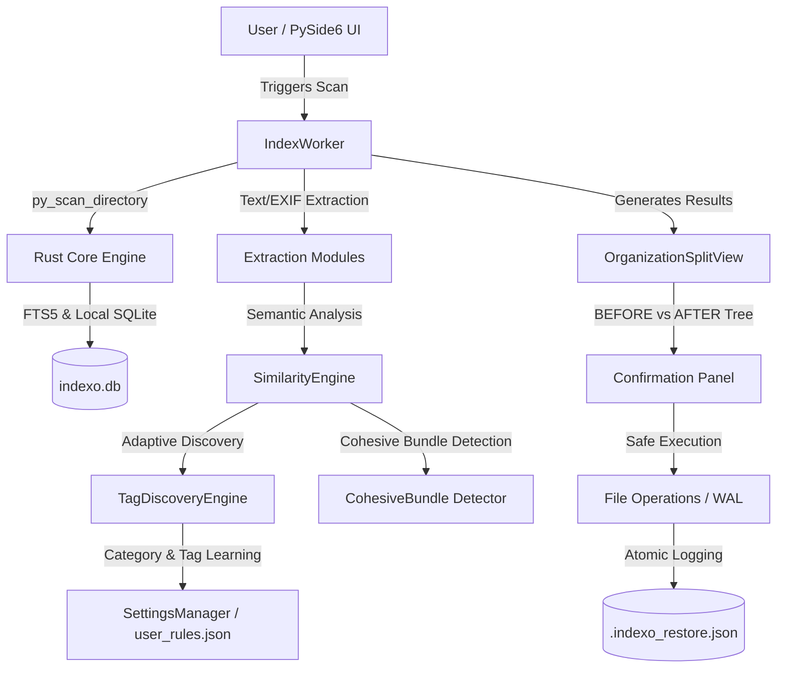

# Indexo — Intelligent Semantic File Organization System

<p align="center">
  
</p>

<p align="center">
  <b>Semantic, intelligent, and adaptive file organizer and indexer for Windows.</b><br>
  Built with a high-performance hybrid architecture: <b>Rust Core (via PyO3)</b> and a native desktop UI in <b>Python (PySide6 / Qt)</b>.
</p>

<p align="center">
  
  
  
  
  
</p>

<p align="center">
  <a href="README.md">🇧🇷 Português</a> | <b>🇺🇸 English</b>
</p>

---

## About the Project

This project was built to serve as a practical and deep dive into the **Rust** ecosystem (high-performance systems programming, memory-safe manipulation, and native C/FFI extension creation with PyO3) while refining my technical skills in **Python** (modern desktop development with PySide6/Qt, asynchronous concurrency with QThread/Workers, modular architecture, and test engineering).

---

## Key Highlights

* **Adaptive Intelligence & Zero-Hardcode**: The application does not enforce rigid, pre-baked rules. When starting from scratch (`tags: []`), it analyzes the user's environment and dynamically learns **Categories** and **Tags** based on real-world file patterns.
* **Preservation of Cohesive Folders (Games, Software, and Projects)**: Detects complete functional bundles (such as game directories, source code projects, or software installations) and offers safe relocation of the **entire parent folder** to the corresponding category, without scattering or renaming vital internal files.
* **Strict Similarity Hierarchy**: Evaluation follows the order **1. Name/Folder -> 2. Content/Text -> 3. Type/Format**.
* **False Positive Protection & Confidence Threshold**: Document rules only match files containing genuine text. Users can configure the confidence threshold in settings (50% to 95%, default 65%); files with lower certainty remain in the source directory as pending.
* **Full 1-Click Undo (WAL)**: Every physical file operation is atomically recorded in a Write-Ahead Log (`.indexo_restore.json`). At any time, you can undo 100% of the session with faithful restoration.
* **High Performance with Rust Core**: Scans tens of thousands of files in milliseconds, multithreaded metadata extraction, and instant `Ctrl+K` global search powered by SQLite FTS5.
* **100% Portable**: Operates without intrusive installers, writing no data to `%APPDATA%` or the Windows Registry.

---

## System Architecture

Indexo uses a layered architecture to combine the low-level power of Rust with the flexibility of the PySide6 UI:



---

## Repository Structure

```text
Indexo/
├── Cargo.toml                  # Master Rust workspace
├── pyproject.toml              # Python, Maturin, Pytest, and Linter configuration
├── rustfmt.toml                # Standard Rust code formatting
├── LICENSE                     # GNU General Public License v3.0
├── CHANGELOG.md                # Changelog and version history (SemVer)
├── README.md                   # Project overview and user guide (Portuguese)
├── README_EN.md                # Project overview and user guide (English)
│
├── rust-core/                  # Native Rust engine (PyO3)
│   ├── Cargo.toml              # Dependencies and compilation optimizations
│   └── src/
│       ├── lib.rs              # Python bindings via PyO3
│       ├── indexing/           # Native scanning and file metadata
│       ├── extraction/         # Text processing and secure hashes
│       ├── classification/     # Rules kernel and fuzzy matching
│       └── utils/              # Path validation and anti-traversal
│
├── python-app/                 # PySide6 Desktop Application
│   ├── main.py                 # Entry point and Single-Instance Lock
│   └── app/
│       ├── main_window.py      # Main window and navigation orchestration
│       ├── classification/     # Similarity engine, tag discovery, and rules
│       │   ├── similarity_engine.py # Hierarchy: Name -> Content -> Type & bundles
│       │   ├── tag_discovery.py     # Dynamic learning of categories and tags
│       │   └── rule_loader.py       # Master and user rules loader
│       ├── widgets/            # UI components
│       │   ├── organization_view.py # Before vs. After tree and bundle panel
│       │   ├── tag_manager_view.py  # Dynamic tag and category manager
│       │   ├── settings_view.py     # General settings and confidence threshold
│       │   ├── stats_view.py        # Statistics dashboard and storage metrics
│       │   └── duplicate_view.py    # Exact duplicate viewer
│       ├── workers/            # Background threads (IndexWorker, FileOpsWorker)
│       └── utils/              # Safe file operations, WAL, and recycle bin
│
├── resources/                  # Visual assets and internationalization
│   ├── icon.ico / icon.png     # High-resolution application icons
│   ├── system_rules.json       # Base semantic rules schema
│   └── i18n/                   # Dynamic translation dictionaries (ptBR.json, enUS.json)
│
├── scripts/                    # Automation and development utilities
│   ├── dev_run.py              # Quick start in development environment
│   ├── check.py                # Unified integrity and rules diagnostic
│   ├── build.py                # Compilation pipeline and portable packaging
│   └── generate_test_dataset.py# Synthetic test dataset generator
│
└── Portable-EXE/               # Consolidated portable distribution
    └── Indexo-Portable/        # Ready-to-run package for Windows
```

---

## How Category and Tag Learning Works

Indexo operates under the principle of **minimal hardcoding and maximum adaptive intelligence**:

1. **Folder Topology (Real-World Hierarchy)**:
   - Structures like `Trips/Beach/photo.jpg` learn `Trips` as the **Category** and `Beach` as the **Tag**.
   - Projects such as `Projects/MyApp/main.py` yield the Category `Projects` and the Tag `MyApp`.
2. **Clustering by Name Macro-Stems**:
   - Files sharing common prefixes (e.g., `Invoice_VendorA`, `Invoice_VendorB`) generate the Category `Invoices` and Tags `VendorA`, `VendorB`.
   - Documents such as `Report_Sales_2024` and `Report_Costs_2024` generate the Category `Reports` and Tags `Sales`, `Costs`.
3. **Game and Software Detection (`CohesiveBundle`)**:
   - Folders containing main executables (`.exe`), assets (`.pak`, `.wad`, `.unity3d`), or runtime libraries are identified as unitary bundles.
   - The application moves the entire folder to `Indexo_Files/Games/<GameName>/`, preserving the internal integrity of all files.
4. **Continuous Persistence**:
   - Every newly discovered category or tag is saved into the `user_rules.json` profile and reused in future sessions.

---

## Getting Started & Development

### Prerequisites

* **Windows 10 or 11 (64-bit)**
* **Python 3.10+**
* **Rust Toolchain (Cargo 1.75+)**

### 1. Clone the Repository

```powershell
git clone https://github.com/your-username/Indexo.git
cd Indexo
```

### 2. Install Dependencies and Build the Rust Core

```powershell
python -m pip install -r python-app/requirements.txt
python -m pip install maturin
maturin develop --manifest-path rust-core/Cargo.toml
```

### 3. Start in Development Mode

```powershell
python scripts/dev_run.py
```

---

## Quality Assurance & Diagnostics

To run the unified diagnostic covering semantic rule integrity, internationalization (i18n) parity, and native Rust tests:

```powershell
python scripts/check.py
```

---

## Building the Portable Version (Stand-Alone EXE)

To generate the release build with optimized native modules and full standalone packaging:

```powershell
python scripts/build.py
```

The self-contained portable executable will be generated at:
`Portable-EXE/Indexo-Portable/Indexo.exe`

---

## Useful Keyboard Shortcuts

| Shortcut | Action |
| :--- | :--- |
| <kbd>Ctrl</kbd> + <kbd>O</kbd> | Select folder for scanning and organization |
| <kbd>Ctrl</kbd> + <kbd>K</kbd> | Quick-open Global Semantic Search |
| <kbd>Ctrl</kbd> + <kbd>Z</kbd> | Undo last organization session (Restore WAL) |
| <kbd>F5</kbd> | Refresh view and re-evaluate current directory |
| <kbd>Ctrl</kbd> + <kbd>T</kbd> | Open Tag and Category Manager |
| <kbd>Ctrl</kbd> + <kbd>,</kbd> | Open Settings panel |

---

## License

This project is free and open-source software, distributed under the **GNU General Public License v3.0 (GPLv3)**. See the [LICENSE](LICENSE) file for more details.
