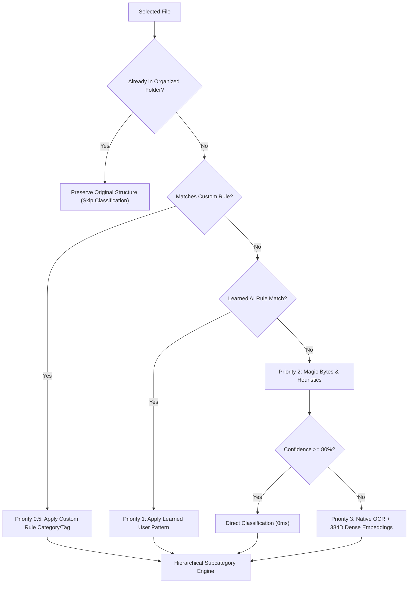

# Indexo — Intelligent Semantic File Organization System

<p align="center">
  
</p>

<p align="center">
  <b>“Index and organize like the library of Alexandria”</b><br>
  Semantic, intelligent, deterministic, portable, and 100% offline file organizer, cataloger, and deduplicator for Windows.<br>
  Built with <b>Native Rust (Tauri 2)</b> backend and <b>Svelte 5 (TypeScript)</b> frontend in the <b>Library of Alexandria & Flexoki</b> theme.
</p>

<p align="center">
  
  
  
  
  
  
</p>

<p align="center">
  <a href="README.md">Português</a> | <b>English</b>
</p>

> [!NOTE]
> **Python version available**: Looking for the previous implementation built in Python (PySide6 / Qt)? It is fully preserved, functional, and available in the dedicated repository [`Indexo-py`](https://github.com/pongitV/Indexo-py).

---

## Table of Contents

- [About the Project](#about-the-project)
- [Key Highlights](#key-highlights)
- [4-Tier Semantic Classification Pipeline](#4-tier-semantic-classification-pipeline)
- [Core Features](#core-features)
  - [1. Side-by-Side Organization & Preview](#1-side-by-side-organization--preview)
  - [2. View-First Visual Deduplicator](#2-view-first-visual-deduplicator)
  - [3. Custom, Default, and AI Rules Manager](#3-custom-default-and-ai-rules-manager)
  - [4. Context-Aware Semantic Renamer](#4-context-aware-semantic-renamer)
  - [5. History, Comparative Trees & Storage Analytics](#5-history-comparative-trees--storage-analytics)
- [Library of Alexandria & Flexoki Theme](#library-of-alexandria--flexoki-theme)
- [Complete Repository Structure](#complete-repository-structure)
- [Getting Started & Development](#getting-started--development)
- [Building the Standalone Portable Executable](#building-the-standalone-portable-executable)
- [License](#license)

---

## About the Project

**Indexo** is a semantic file organizer and cataloger engineered to turn messy Windows directories (like *Downloads*, *Documents*, *Desktop*, or scattered project folders) into a pristine, deterministic personal archive.

Inspired by the classical **Library of Alexandria** and Steph Ango's **Flexoki** palette, Indexo operates under the principle of **adaptive intelligence without rigid hardcoding**: it inspects true file content via *magic bytes*, native OCR, and semantic context, suggesting structured directory trees without moving anything without explicit user approval.

### Core Principles:
1. **100% Offline & Private**: Zero background services, zero trackers, zero telemetry. Everything runs on-demand locally on your machine.
2. **High-Performance Rust Backend**: Built in **Rust 2021** with native `rayon` parallelism, processing tens of thousands of files with instant response times and minimal RAM usage.
3. **Reactive Svelte 5 Frontend**: Modern desktop interface with compact dropdown menus, keyboard shortcuts, multi-selection, and fluid transitions.
4. **Absolute Safety (Zero Data Loss)**: Transactions are fully auditable with **1-click undo**. The deduplicator sends items to the Windows Recycle Bin by default.

---

## Key Highlights

* **Native OCR for Images & Scans (`Windows.Media.Ocr`)**: Reads text from receipts, screenshots, and photos without third-party downloads or external APIs.
* **Pre-Organized Folder Detection**: Identifies structured folders during the initial scan pass and preserves them untouched to prevent category pollution.
* **3-Stage Visual Deduplicator (View-First)**: Fast hash-based duplicate detector (Size $\rightarrow$ 64KB Prefix $\rightarrow$ Full SHA-256) with side-by-side visual comparison, image previews, and Recycle Bin safety.
* **Rule Engine (Custom, Default & AI)**: Visual conditional builder (*IF [field] [operator] [value] THEN [action]*), built-in heuristic inspector, and catalog of AI-learned rules.
* **History & Storage Analytics Dashboard**: Chronological audit trail with side-by-side comparative trees, space-saved counters, and category volume breakdown.
* **Library of Alexandria & Flexoki Palette**: Authentic **antique book-page beige** in light mode and ink-and-charcoal in dark mode with Terracotta and Amber accents.

---

## 4-Tier Semantic Classification Pipeline



1. **Priority 0 — Pre-Organized Folders**: Identifies structured folders and preserves their original layout.
2. **Priority 0.5 — User Custom Rules**: Evaluates user-defined conditional rules created in the Rule Builder before any heuristics.
3. **Priority 1 — AI-Learned Rules**: Checks user correction history stored in local SQLite (`data/profile.db`).
4. **Priority 2 — Native Heuristics & Magic Numbers**: Inspects actual file header bytes (`infer`), detecting media, documents, archives, and code.
5. **Priority 3 — Native OCR & Dense Embeddings**: Extracts text via `Windows.Media.Ocr`, `pdf-extract`, and `docx-rs` for semantic clustering.

---

## Core Features

### 1. Side-by-Side Organization & Preview
* Drag & drop any directory or use the folder picker.
* Compare **Original vs Proposed** structures side-by-side before executing disk operations.
* Multi-selection (`Ctrl+Click`, `Shift+Click`) with a floating batch action bar for changing categories, tags, or skipping files.

### 2. View-First Visual Deduplicator
* 3-stage hashing (Size $\rightarrow$ 64KB prefix $\rightarrow$ SHA-256).
* Side-by-side comparison cards with thumbnail previews, pixel resolution, timestamps, and path info.
* Smart keep suggestions (*Cleanest name*, *Highest resolution*, *Newest*).
* Safe deletion via **Windows Recycle Bin** or optional permanent purge.

### 3. Custom, Built-in (Editable) & AI Rules Builder
* **Full Built-in Heuristics Customization**: Customize recognized file extensions, active subfolders, grouping behavior (`Auto`, `By Year`, etc.), and semantic keywords for each native system category (`Media`, `Executaveis`, `Documentos`, `Projetos`, etc.).
* **Granular Section & Full Factory Reset**: Revert just extensions, just subfolders, or restore entire categories / full factory defaults with a single click.
* **Visual Custom Rules Builder**: Create prioritized conditional rules (*IF [field] [operator] [value] THEN [action]*).
* **AI Learned Rules Auditing**: Indexo automatically learns patterns from manual user reclassifications in Preview or the Unidentified files modal without any hardcoded assumptions.

### 4. Standardized Hyphenated Taxonomy & Specialized Subfolders
* Strict folder taxonomy using clean hyphens instead of spaces:
  - `Media/Imagens-Fotografias`, `Media/Videos-Gravacoes`, `Media/Audios-Musicas`
  - `Executaveis/Jogos-Emuladores-ROMs` (with platform subfolders for *Nintendo-NES*, *Super-Nintendo-SNES*, *Nintendo-64*, *Nintendo-Switch*, *PlayStation*, *Sega*, etc.), `Executaveis/Aplicativos-Utilitarios`, `Executaveis/Instaladores-Setups`
  - `Documentos/Fiscais-Pessoais`, `Documentos/Trabalho`, `Documentos/Estudos`
  - `Projetos/Repositorios-GitHub`, `Projetos/Repositorios-Locais`, `Projetos/Modelos-3D-CAD`, `Projetos/Scripts-Automacoes`

### 5. Context-Aware Semantic Renamer
* Batch sanitization removing camera/messenger noise (`IMG_`, `WA_`, `Scan_`).
* Standardized names with formatted dates, category context, and sequence counters.
* Full renaming history with 1-click restore.

### 6. History, Comparative Trees & Storage Analytics
* Chronological transaction log of all organization and renaming sessions with **Undo** support.
* 3 interactive views per session: **Proposed Tree**, **Created Categories**, **Created Tags**, and **Moved Files**.
* **Storage & Analytics Widget**: Total space organized, total cataloged files, and proportional volume breakdown.
* **Full User Data Reset with Safe Confirmation**: Option in Settings to purge all SQLite databases and local profiles by typing `"sim"`.

---

## Library of Alexandria & Flexoki Theme

The visual design and color palette of Indexo were inspired by the **[Flexoki](https://stephango.com/flexoki)** color scheme (created by [Steph Ango](https://stephango.com/)), engineered specifically for comfortable reading of prose and code, merged with the warm atmosphere of classical manuscripts and leather-bound books from the ancient Library of Alexandria:

* **Color Inspiration ([Flexoki](https://stephango.com/flexoki))**: An inking palette with balanced thermal contrast designed to eliminate eye fatigue during long cataloging sessions.
* **Day Mode (*Alexandria Day*)**:
  - Background: **Antique Book-Page Beige** (`#EFE5D3` / `#E4D8C2`).
  - Typography: **Deep Charcoal & Sepia Ink** (`#211912`).
  - Accents: **Terracotta Bookbinder Leather** (`#BC5215`).
* **Night Mode (*Alexandria Night*)**:
  - Background: **Warm Charcoal & Ink** (`#100F0F` / `#1C1B1A`).
  - Typography: **Soft Parchment Cream** (`#CECDC3`).
  - Accents: **Luminous Amber & Gold** (`#DA702C`).
* **Alexandria Easter Egg**: Click the Indexo logo in the top menu to view the animated mouse greeting and philosophy modal.

---

## Complete Repository Structure

```text
Indexo/
├── index.html                      # Frontend HTML entry point with Alexandria SVG favicon
├── package.json                    # Vite & Tauri frontend dependencies
├── tsconfig.json                   # TypeScript configuration
├── vite.config.ts                  # Vite build configuration
├── README.md                       # Portuguese documentation
├── README_EN.md                    # English documentation
├── LICENSE                         # GNU GPLv3 License
│
├── assets/                         # Media assets
│   └── alexandria_mouse.gif        # Library of Alexandria animated logo
│
├── src/                            # Frontend (Svelte 5 + TypeScript)
│   ├── App.svelte                  # Route orchestrator, dropdown navigation & Easter egg
│   ├── routes/
│   │   ├── FolderSelect.svelte     # Clean directory picker and rename toggle
│   │   ├── Scanning.svelte         # Real-time scan progress feedback
│   │   ├── Preview.svelte          # Side-by-side comparative tree & batch action bar
│   │   ├── Renamer.svelte          # Intelligent batch renamer
│   │   ├── Duplicates.svelte       # View-first visual deduplicator
│   │   ├── RulesManager.svelte     # Custom, default & AI rule builder
│   │   ├── History.svelte          # Session history, comparative trees & analytics
│   │   ├── TagManager.svelte       # Semantic tag management
│   │   ├── CategoryManager.svelte  # Category & destination directory management
│   │   └── Settings.svelte         # Theme, language & maintenance settings
│   │
│   ├── lib/
│   │   ├── api.ts                  # Typed Tauri command bridge
│   │   ├── stores.ts               # Global reactive state
│   │   ├── FileTreeNode.svelte     # Interactive tree node component
│   │   └── ...                     # Preview, history & audit modals
│   │
│   └── styles/
│       └── theme.css               # Library of Alexandria / Flexoki design tokens
│
└── src-tauri/                      # Native backend (Rust 2021 / Tauri 2)
    ├── Cargo.toml                  # Rust dependencies
    ├── tauri.conf.json             # Tauri 2 configuration
    ├── icons/                      # Multi-resolution icons (.ico, .png)
    └── src/
        ├── main.rs                 # Entry point & command registrations
        ├── commands/               # Handlers for scan, classify, duplicates, rules, history
        ├── engine/                 # 4-tier classifier, OCR, embeddings, duplicates engine
        └── db/                     # Local SQLite layer (data/profile.db in WAL mode)
```

---

## Getting Started & Development

### Prerequisites
* **Windows 10 or 11 (64-bit)**
* **Rust Toolchain** (`rustc` & `cargo` via [rustup.rs](https://rustup.rs))
* **Node.js 18+** & **npm** ([nodejs.org](https://nodejs.org))

### 1. Clone & Install

```powershell
git clone https://github.com/pongitV/Indexo.git
cd Indexo
npm install
```

### 2. Run in Development Mode

```powershell
npm run tauri dev
```

---

## Building the Standalone Portable Executable

To compile the optimized standalone release executable:

```powershell
npm run tauri build
```

Compiled binaries:
* **Standalone Portable Executable**: `src-tauri/target/release/indexo.exe`
* **NSIS Installer**: `src-tauri/target/release/bundle/nsis/Indexo_0.1.0_x64-setup.exe`

---

## License

Distributed under the **GNU General Public License v3.0 (GPLv3)**. See [LICENSE](LICENSE) for details.
